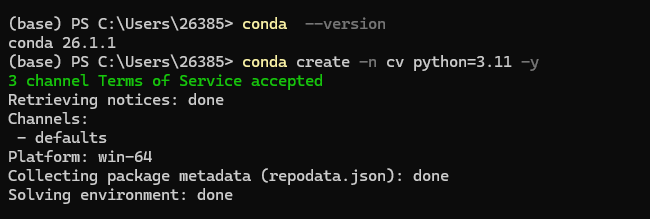
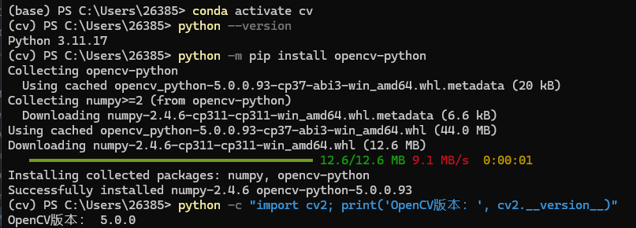
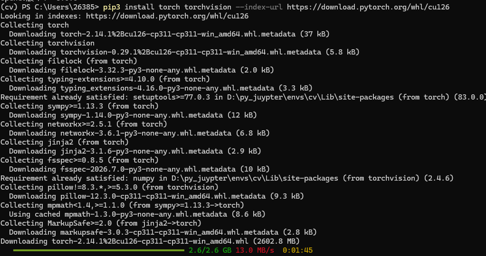
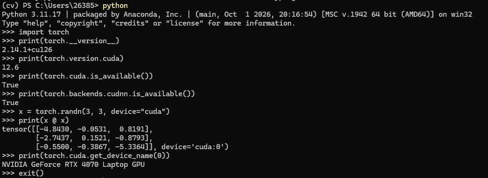

# 实验一：计算机视觉库的安装

姓名：王泽同    学号：202410315010   班级：人工智能241

## 一、实验目的

掌握 Anaconda 的基本操作和虚拟环境管理方法；完成 OpenCV 与 PyTorch 的安装；理解 NVIDIA 驱动、CUDA 与 cuDNN 在 GPU 加速中的作用，并通过实际张量运算验证环境可用性，为后续计算机视觉实验建立运行环境。

## 二、实验环境

| 项目 | 实际环境或版本 |
| --- | --- |
| 操作系统 / 终端 | Windows 64 位 / PowerShell |
| 环境管理工具 | Anaconda；conda 26.1.1 |
| 虚拟环境 / Python | cv / Python 3.11.17 |
| OpenCV / NumPy | OpenCV 5.0.0（安装包 5.0.0.93）/ NumPy 2.4.6 |
| PyTorch / CUDA | PyTorch 2.14.1+cu126 / CUDA 12.6（PyTorch 构建版本） |
| GPU | NVIDIA GeForce RTX 4070 Laptop GPU |

## 三、实验过程

### 1. 检查 conda 并创建虚拟环境

检查 conda 版本后，创建名为 cv 的独立环境，并指定 Python 3.11。随后激活该环境并检查 Python 版本，使后续库的安装和运行使用同一解释器。

```powershell
conda --version
conda create -n cv python=3.11 -y
conda activate cv
python --version
```



*图1  conda 版本检查与 cv 环境创建*

结果：conda 输出版本 26.1.1；创建命令完成依赖求解。下一张截图中提示符已变为 (cv)，且 Python 输出 3.11.17，进一步确认环境创建和激活成功。

### 2. 安装并验证 OpenCV

在 cv 环境中通过 Python 对应的 pip 安装 opencv-python。安装后导入 cv2 并输出版本号，检查库是否能被当前环境正常调用。

```powershell
python -m pip install opencv-python
python -c "import cv2; print('OpenCV版本：', cv2.__version__)"
```



*图2  cv 环境激活、OpenCV 安装与导入验证*

结果：安装日志显示 numpy-2.4.6 与 opencv-python-5.0.0.93 安装成功；cv2.__version__ 输出 5.0.0，且无导入异常，说明 OpenCV 在该环境中可正常使用。

### 3. 配置 PyTorch GPU 加速环境

使用 PyTorch 官方 cu126 软件包源，在 cv 环境安装 torch 与 torchvision。cu126 表示 CUDA 12.6 构建；官方 CUDA 版软件包提供所需运行库，实际 GPU 使用还依赖兼容的 NVIDIA 驱动。

```powershell
pip3 install torch torchvision --index-url https://download.pytorch.org/whl/cu126
```



*图3  从 PyTorch 官方 cu126 软件包源下载安装*

图3记录了 torch 2.14.1+cu126 与 torchvision 0.29.1+cu126 的下载过程；其中下载进度尚未结束。后续图4中 torch 成功导入并输出版本，确认 PyTorch 已安装成功。torchvision 的独立导入验证未记录。

过程说明：现有截图未记录 nvidia-smi、独立 CUDA Toolkit / cuDNN 的安装或 nvcc 验证。本报告据实记录 CUDA 版 PyTorch 的安装与运行结果，不将其写作已完成的独立 Toolkit 安装过程。

### 4. 验证 CUDA、cuDNN 与实际 GPU 运算

在 cv 环境进入 Python 交互模式，依次检查 PyTorch 版本、CUDA 构建版本及 CUDA、cuDNN 可用性，再直接在 GPU 上创建随机矩阵并执行矩阵乘法。

```python
import torch
print(torch.__version__)
print(torch.version.cuda)
print(torch.cuda.is_available())
print(torch.backends.cudnn.is_available())
x = torch.randn(3, 3, device="cuda")
print(x @ x)
print(torch.cuda.get_device_name(0))
```



*图4  PyTorch、CUDA、cuDNN 与 GPU 矩阵运算验证*

| 验证项目 | 实际输出 | 结论 |
| --- | --- | --- |
| torch.__version__ | 2.14.1+cu126 | CUDA 版 PyTorch 可导入 |
| torch.version.cuda | 12.6 | 构建所用 CUDA 版本为 12.6 |
| torch.cuda.is_available() | True | PyTorch 可访问 CUDA 设备 |
| torch.backends.cudnn.is_available() | True | 当前 PyTorch 的 cuDNN 后端可用 |
| GPU 矩阵乘法 | 输出 3×3 张量，device='cuda:0' | 实际 GPU 运算成功 |
| GPU 设备名称 | NVIDIA GeForce RTX 4070 Laptop GPU | 识别到本机 NVIDIA GPU |

矩阵为随机生成，其数值不作为固定验收标准。关键依据是运算未报错、输出张量位于 cuda:0，且识别出的设备名称与本机 GPU 一致。

## 四、实验结果与分析

### 1. 环境隔离与安装结果

本实验建立了 cv 虚拟环境，并在其中完成 OpenCV 和 PyTorch 的安装与验证。提示符 (cv) 与 Python 3.11.17 的版本输出表明实验操作使用了目标环境。独立环境能够减少不同实验之间的依赖冲突，也便于后续维护和复用。

OpenCV 安装包版本为 5.0.0.93，而导入后 cv2.__version__ 显示 5.0.0，二者分别是软件包发行版本与库的版本信息，不构成安装失败。导入成功表明本次基础安装验证通过；图像读取、显示和处理功能可在后续实验中继续验证。

### 2. GPU 加速验证结果

PyTorch 版本带有 +cu126 标识，torch.version.cuda 输出 12.6，说明安装了对应 CUDA 构建的 PyTorch。torch.cuda.is_available() 返回 True，表明当前运行环境可访问 CUDA 设备；torch.backends.cudnn.is_available() 返回 True，表明当前 PyTorch 的 cuDNN 后端可用。

在可用性检查之外，实验使用 device="cuda" 创建张量，并执行 x @ x。结果张量标记 device='cuda:0'，确认基础矩阵运算已在 GPU 上成功完成。该验证能够支持后续 GPU 计算实验，但不代表已测量模型训练速度或验证了所有深度学习算子。

### 3. CUDA 版本与记录范围

NVIDIA 驱动支持的 CUDA 版本、系统独立安装的 CUDA Toolkit 版本，以及 torch.version.cuda 输出的 PyTorch 构建版本是不同信息。不能只根据 torch.version.cuda 推断系统已独立安装同版本 Toolkit，也不能将 cuDNN 可用性检查写作其独立安装记录。

参考文档还包含 nvidia-smi、CUDA Toolkit 和 cuDNN 安装相关环节。提供的四张截图覆盖 conda 环境、OpenCV、CUDA 版 PyTorch 安装及 GPU 运算验证；其余环节没有截图证据。如果课程要求逐项记录独立安装过程，应补充对应操作和截图。

## 五、实验总结

通过本次实验，我掌握了 conda 环境创建、激活与版本检查的基本方法，完成了 OpenCV 和 CUDA 版 PyTorch 的安装，并通过库导入、CUDA / cuDNN 可用性检查及 GPU 矩阵运算验证了运行环境。

实验使我认识到，安装成功不能仅依据下载日志判断，还需要在目标环境中实际导入和运行。同时，不同组件的 CUDA 版本信息具有不同含义，需要结合驱动、软件包构建和实际运行结果进行判断。现有 cv 环境已具备开展基础图像处理及 PyTorch GPU 计算实验的条件。
