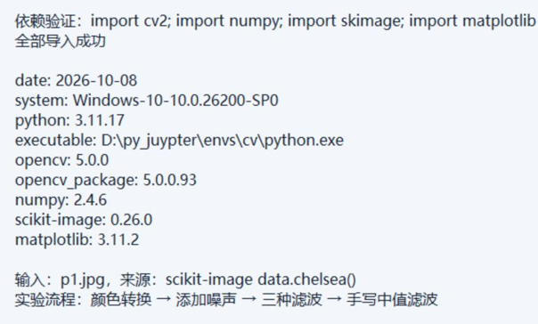
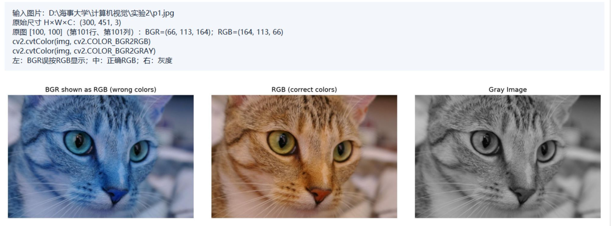
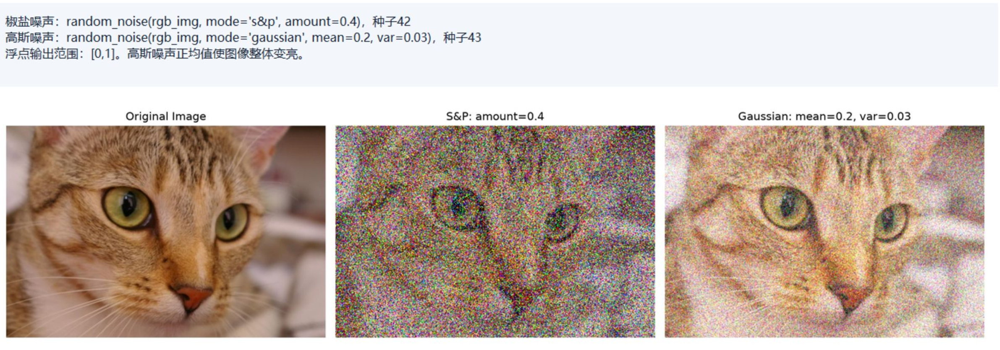
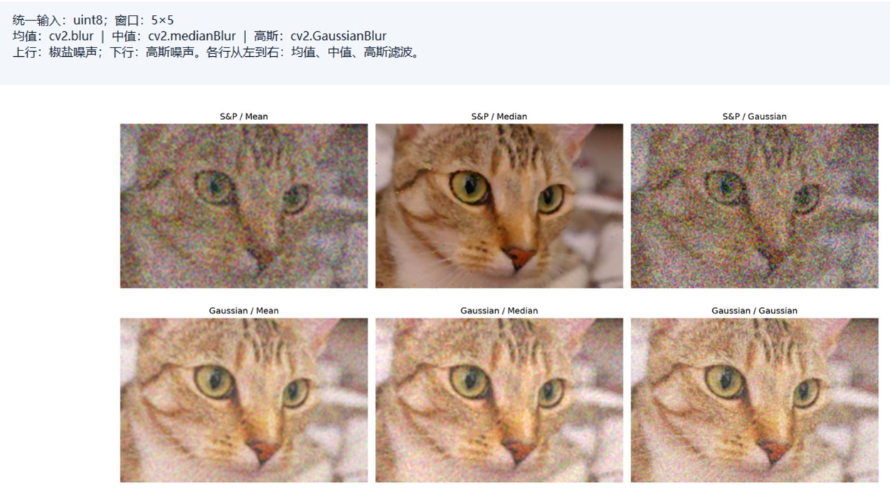
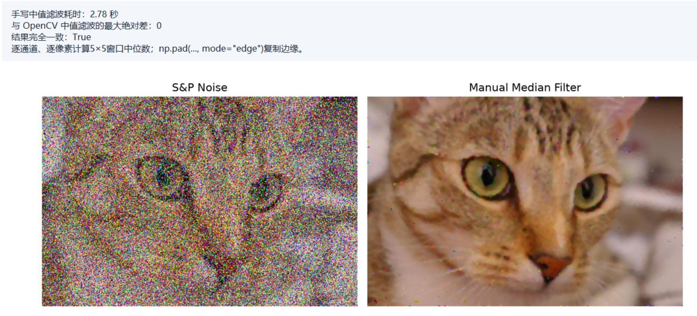
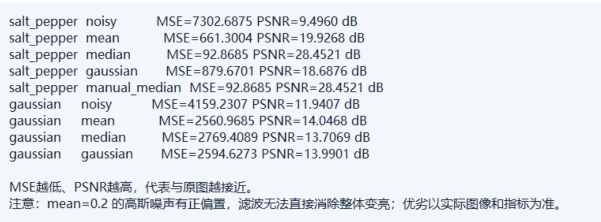

# 实验二：图像增强

姓名：王泽同    学号：202410315010   班级：人工智能241

## 一、实验目的

掌握 OpenCV 的基本图像处理方法，完成彩色图像读取、像素访问及颜色空间转换；理解椒盐噪声和高斯噪声的特点，比较均值滤波、中值滤波与高斯滤波的去噪效果；手动实现彩色图像的中值滤波，并与 OpenCV 的输出进行对比，加深对邻域运算、边界处理和图像增强的理解。

## 二、实验环境

| 项目 | 实际环境或版本 |
| --- | --- |
| 实验日期 | 2026年10月8日 |
| 操作系统 / 执行终端 | Windows 64 位（系统构建号26200）/ PowerShell |
| 环境管理工具 | Anaconda；conda 26.1.1 |
| 虚拟环境 / Python | cv / Python 3.11.17 |
| Python 解释器 | `D:\py_juypter\envs\cv\python.exe` |
| OpenCV | 5.0.0；安装包 opencv-python 5.0.0.93 |
| NumPy | 2.4.6 |
| scikit-image | 0.26.0 |
| Matplotlib | 3.11.2 |
| 输入图片 | `p1.jpg`，451×300像素，三通道彩色图像 |
| 图像来源 | scikit-image 自带的 `data.chelsea()` 猫图，保存为 JPEG，质量参数95 |
| 滤波窗口 | 5×5 |
| 随机种子 | 椒盐噪声42，高斯噪声43 |

实验沿用实验一的 `cv` 环境，全部图像处理在 CPU 上完成。输入图片未超过脚本默认的512像素长边限制，因此本次没有进行尺寸缩放。采用另一张猫图完成与参考文档相同的实验流程，像素值和处理结果均以实际运行输出为准。

## 三、实验过程

### 1. 验证环境并导入依赖库

在 `cv` 环境中补充安装 scikit-image 和 Matplotlib。此前安装出现 `No matching distribution found for matplotlib`，改用清华镜像后安装成功。通过指定解释器路径执行，保证依赖安装和实验运行使用同一环境。

```powershell
& 'D:\py_juypter\envs\cv\python.exe' -m pip install scikit-image matplotlib -i https://pypi.tuna.tsinghua.edu.cn/simple --timeout 30
```

在实验代码中导入以下依赖：OpenCV 用于颜色转换和滤波；scikit-image 用于添加噪声；NumPy 用于数组计算和手写滤波；Matplotlib 用于保存对比图。

```python
import cv2
from skimage.util import random_noise
import numpy as np
import matplotlib
matplotlib.use("Agg")
from matplotlib import pyplot as plt
```

随后执行完整实验：

```powershell
Set-Location 'D:\海事大学\计算机视觉\实验2'
& 'D:\py_juypter\envs\cv\python.exe' -X utf8 experiment2.py
```



*图1  cv 环境与图像处理依赖验证*

结果：四个依赖库均成功导入，Python 为3.11.17，OpenCV 为5.0.0，NumPy 为2.4.6，scikit-image 为0.26.0，Matplotlib 为3.11.2。解释器路径位于 `cv` 环境中，确认本次实验使用了实验一建立的环境。

记录方式：图1—图6均为实际结果展示窗口的截图。该窗口读取本次实验生成的环境记录、处理图像和运行日志，集中展示各步骤结果；截图不是终端安装过程记录。

### 2. 读取图像、访问像素并转换颜色空间

读取本地 `p1.jpg`，访问数组索引 `[100,100]` 处的像素。考虑到 Windows 下路径中含有中文，使用 `np.fromfile` 读取文件数据，再通过 `cv2.imdecode` 解码；所得图像与 OpenCV 常规彩色读取一样采用 BGR 通道顺序。

```python
img = cv2.imdecode(
    np.fromfile(source, dtype=np.uint8),
    cv2.IMREAD_COLOR
)
b, g, r = map(int, img[100, 100])
rgb_img = cv2.cvtColor(img, cv2.COLOR_BGR2RGB)
gray_img = cv2.cvtColor(img, cv2.COLOR_BGR2GRAY)
```

分别保存直接显示 BGR 数组、转换后正确显示 RGB，以及灰度显示的图像。



*图2  图像读取、像素值与颜色空间转换对比*

| 验证项目 | 实际输出 | 说明 |
| --- | --- | --- |
| 图像数组形状 | `(300, 451, 3)` | 高300、宽451、三个颜色通道 |
| 原图 `[100,100]` 的 BGR | `(66, 113, 164)` | 第101行、第101列的像素 |
| 对应 RGB | `(164, 113, 66)` | 红、蓝通道顺序交换 |
| 灰度数组形状 | `(300, 451)` | 单通道亮度图像 |

结果：直接将 BGR 数组交给 Matplotlib 会出现明显错色，猫的毛发呈偏蓝色；转为 RGB 后显示为正常的棕黄色。灰度图失去颜色信息，但保留眼睛、毛发和轮廓的亮度差异。

参考文档中将 `print(b,g,r)` 的输出描述为 RGB，需要按代码纠正：OpenCV 此处输出的是 BGR。BGR 转 RGB 的作用是适配显示工具的通道约定，避免显示错误，并非改变物体本来的颜色。

### 3. 添加椒盐噪声与高斯噪声

在 RGB 原图上分别添加两种噪声，保留参考文档的参数设置，并固定随机种子以便重复比较。

```python
sp_noise_img = random_noise(
    rgb_img, mode="s&p", amount=0.4,
    rng=np.random.default_rng(42)
)
gus_noise_img = random_noise(
    rgb_img, mode="gaussian", mean=0.2, var=0.03,
    rng=np.random.default_rng(43)
)
```



*图3  原图、椒盐噪声与高斯噪声对比*

结果：椒盐噪声产生大量突变噪点，对局部颜色和纹理造成明显破坏。本次对三通道数组直接添加噪声，各通道元素独立受扰动，因此可观察到彩色噪点；`amount=0.4` 是数组元素的扰动比例参数，不能简单解释成40%的完整彩色像素均被替换为黑白点。

高斯噪声产生连续的随机亮度与颜色扰动，且整幅图像明显变亮。参数作用于归一化后的 `[0,1]` 范围，`mean=0.2` 为正均值，`var=0.03` 对应标准差约0.173。超出有效范围的值被裁剪，因此这组参数既引入随机波动，也造成亮度偏置和部分高亮区域的信息损失。

### 4. 使用三种滤波方法去噪

`random_noise` 输出 `[0,1]` 范围的浮点图像。为统一三种方法的输入条件，将噪声图像乘255、四舍五入并转换为 `uint8`，再对两种噪声分别执行5×5均值、中值和高斯滤波。

```python
sp_u8 = np.rint(sp_noise_img * 255).astype(np.uint8)
gus_u8 = np.rint(gus_noise_img * 255).astype(np.uint8)

mean_sp = cv2.blur(sp_u8, (5, 5))
mean_gus = cv2.blur(gus_u8, (5, 5))
mid_sp = cv2.medianBlur(sp_u8, 5)
mid_gus = cv2.medianBlur(gus_u8, 5)
gauss_sp = cv2.GaussianBlur(sp_u8, (5, 5), 0)
gauss_gus = cv2.GaussianBlur(gus_u8, (5, 5), 0)
```



*图4  两种噪声下均值、中值和高斯滤波的六组结果*

图4上行为椒盐噪声，下行为高斯噪声；每行从左到右依次为均值、中值和高斯滤波。均值滤波对邻域像素等权平均，中值滤波取邻域的中位数，高斯滤波依据高斯权重计算加权平均。

结果：椒盐噪声经中值滤波后，大部分彩色噪点被去除，猫眼和脸部轮廓恢复较明显；均值与高斯滤波仍保留可见的颜色扰动。对高斯噪声，三种方法均减弱随机波动，但输出仍整体偏亮，并有不同程度的纹理模糊。

### 5. 手动实现彩色中值滤波

逐通道、逐像素遍历图像，在每个像素位置提取5×5邻域，计算其中位数作为输出。使用 `mode="edge"` 复制边缘进行补齐，与 OpenCV 中值滤波的边界处理方式保持一致。

```python
def manual_median_filter_color(image, kernel_size=5):
    if kernel_size < 1 or kernel_size % 2 == 0:
        raise ValueError("滤波窗口大小必须是正奇数")
    if image.ndim != 3 or image.shape[2] != 3:
        raise ValueError("输入必须是三通道彩色图像")
    pad = kernel_size // 2
    result = np.zeros_like(image)
    for c in range(3):
        channel = image[:, :, c]
        padded = np.pad(channel, pad_width=pad, mode="edge")
        for i in range(channel.shape[0]):
            for j in range(channel.shape[1]):
                region = padded[i:i + kernel_size, j:j + kernel_size]
                result[i, j, c] = np.median(region)
    return result

manual_mid = manual_median_filter_color(sp_u8, kernel_size=5)
diff = np.abs(manual_mid.astype(np.int16) - mid_sp.astype(np.int16))
print(int(diff.max()))
print(np.array_equal(manual_mid, mid_sp))
```



*图5  手写中值滤波效果与 OpenCV 一致性验证*

| 验证项目 | 实际输出 | 结论 |
| --- | --- | --- |
| 手写算法处理尺寸 | 300×451×3 | 对完整输入图像逐通道处理 |
| 窗口与边界处理 | 5×5 / 复制边缘 | 与 OpenCV 中值滤波保持一致 |
| 本次手写滤波耗时 | 2.78秒 | 单次执行记录，受机器负载影响 |
| 最大绝对差 | 0 | 所有通道元素均无差异 |
| `np.array_equal` | `True` | 手写结果与 OpenCV 完全一致 |

结果：手写算法明显抑制了椒盐噪声，输出与 OpenCV 中值滤波逐像素相同。差值计算前转换为有符号整数，避免 `uint8` 减法溢出导致错误判断。本次未测量 OpenCV 滤波耗时，因此不根据该记录给出速度倍数。

### 6. 计算去噪结果的 MSE 与 PSNR

以读取后的无噪声 RGB 原图为基准，计算不同结果的均方误差 MSE 和峰值信噪比 PSNR，补充视觉比较。计算覆盖全部像素和三个颜色通道，使用滤波后的数组，不使用绘图截图或再次压缩的对比图片。

```python
mse = np.mean(
    (image.astype(np.float64) - rgb_img.astype(np.float64)) ** 2
)
psnr = float("inf") if mse == 0 else 10 * np.log10(255 ** 2 / mse)
```



*图6  各组去噪结果的 MSE 与 PSNR 实际输出*

| 噪声类型 | 处理方法 | MSE | PSNR / dB |
| --- | --- | ---: | ---: |
| 椒盐噪声 | 未滤波 | 7302.6875 | 9.4960 |
| 椒盐噪声 | 均值滤波 | 661.3004 | 19.9268 |
| 椒盐噪声 | 中值滤波 | 92.8685 | 28.4521 |
| 椒盐噪声 | 高斯滤波 | 879.6701 | 18.6876 |
| 椒盐噪声 | 手写中值滤波 | 92.8685 | 28.4521 |
| 高斯噪声 | 未滤波 | 4159.2307 | 11.9407 |
| 高斯噪声 | 均值滤波 | 2560.9685 | 14.0468 |
| 高斯噪声 | 中值滤波 | 2769.4089 | 13.7069 |
| 高斯噪声 | 高斯滤波 | 2594.6273 | 13.9901 |

MSE 越小、PSNR 越高，表示输出与基准原图在像素数值上越接近。该指标可以支持本次结果比较，但不能完全代替对纹理、边缘和视觉自然程度的观察。

## 四、实验结果与分析

### 1. 图像读取与颜色显示

本实验成功读取451×300的彩色图像，并取得指定像素的 BGR 和 RGB 数值。对比显示表明，OpenCV 与 Matplotlib 的通道约定不同，正确显示需要先将 BGR 转为 RGB。灰度转换则将三个颜色通道映射为亮度信息，使轮廓和明暗结构更突出，但无法保留颜色差异。

### 2. 噪声的分布与亮度影响

椒盐噪声使部分通道元素出现极端值，表现为突变的彩色噪点，局部结构被明显破坏。高斯噪声对整幅图像产生随机偏差，影响更广泛。本实验高斯噪声均值为0.2，不能将其解释为只有零均值的随机抖动；正均值及数值裁剪共同导致整体变亮，这也是滤波结果仍与原图存在较大误差的原因。

### 3. 椒盐噪声下的滤波比较

中值滤波的 PSNR 为28.4521 dB，明显高于均值滤波的19.9268 dB和高斯滤波的18.6876 dB，与图4中噪点减少、脸部结构恢复的视觉观察一致。中位数对邻域中的少量极端值相对不敏感，因此适合处理脉冲型噪声。

均值和高斯滤波会将异常像素参与平均计算，极端值的影响可能扩散到邻域，导致残余颜色扰动。中值滤波也会损失部分细小毛发和胡须细节，不能认为去噪后完全恢复了原图。本次噪声参数较强，边缘附近仍可观察到少量噪点。

### 4. 高斯噪声下的滤波比较

三种滤波均提高了高斯噪声图像的 PSNR。均值滤波为14.0468 dB，高斯滤波为13.9901 dB，中值滤波为13.7069 dB；本次以像素误差衡量时，均值滤波略优于高斯滤波，二者的 PSNR 差值约0.0567 dB，不宜扩大为普遍结论。

平滑处理能够降低随机变化，却不能直接消除正均值造成的整体亮度偏置，也不能还原裁剪后丢失的信息。因此三种结果仍明显偏亮，且存在平滑带来的细节损失。参考文档“高斯滤波最佳”的表述应结合具体图片与指标检验，本次实际输出不支持将其作为绝对结论。

### 5. 手写中值滤波验证

手写算法与 OpenCV 的输出最大绝对差为0，说明本次输入、窗口大小、逐通道处理和边界补齐方式一致时，能够复现库函数的结果。逐通道滤波是本实验采用的彩色处理方法，验证结果支持该实现与 OpenCV 的一致性，但不代表它是所有彩色滤波问题的唯一方法。

手写实现直观展示了邻域提取与中位数计算过程。本次运行耗时2.78秒，体现了逐像素循环的计算开销；后续处理较大图像时，可以考虑优化数组计算或采用库函数。本实验重点是验证算法正确性，没有开展系统性能测试。

## 五、实验总结

本实验完成了图像读取、BGR 与 RGB 通道转换、灰度转换、椒盐与高斯噪声添加、三种 OpenCV 滤波以及彩色中值滤波的手写实现，并结合实际截图、MSE 和 PSNR 对结果进行了分析。

实验结果表明，本次中值滤波对椒盐噪声的去除效果最明显；对于参考参数下的高斯噪声，均值与高斯滤波均能降低随机扰动，其中均值滤波的 PSNR 略高。手写中值滤波与 OpenCV 输出完全一致，验证了逐通道邻域中位数计算和复制边缘处理的正确性。

通过本实验，进一步理解了通道顺序、数组数据类型、噪声参数和边界处理对结果的影响。图像增强需要在去噪和保留细节之间权衡，分析结论应依据实际输出，而不能仅凭算法名称判断哪种方法最好。
